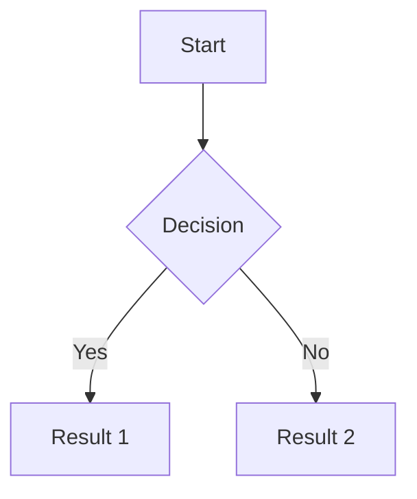

# VitePress to Astro Starlight Migration Plan

## Project Overview

**Current State:** VitePress documentation site
**Target State:** Astro Starlight with enhanced plugins
**Content:** 336 markdown files (~1.4 MB) across 14 sections
**Live Site:** https://irregularpedia.org
**Deployment:** Cloudflare Pages via Forgejo CI/CD

---

## Phase 0: Pre-Migration Checkpoint

### 0.1 Create Safety Checkpoint
```bash
# Commit any pending changes
git add -A
git commit -m "chore: Pre-migration checkpoint - all current changes"

# Create migration branch
git checkout -b feat/astro-starlight-migration

# Tag the VitePress version for easy rollback
git tag v1.0.0-vitepress -m "Last VitePress version before Starlight migration"
git push origin v1.0.0-vitepress
```

### 0.2 Backup Critical Files
- [ ] `.vitepress/config.ts` - Navigation structure reference
- [ ] `docs/tags.data.ts` - Tags implementation reference
- [ ] `docs/tags.md` - Tags page template reference
- [ ] `docs/index.md` - Homepage layout reference

---

## Phase 1: Project Setup

### 1.1 Initialize Astro Starlight
```bash
# Create new Astro project alongside existing
npm create astro@latest -- --template starlight starlight-temp

# We'll merge the config into our existing structure
```

### 1.2 Update package.json
Replace VitePress dependencies with Astro Starlight stack:

**Remove:**
- `vitepress`
- `vue`

**Add:**
- `astro` (^5.x)
- `@astrojs/starlight` (latest)
- `sharp` (image optimization)

### 1.3 Project Structure Transformation

**Current VitePress Structure:**
```
IrregularChatWiki/
├── .vitepress/
│   └── config.ts
├── docs/
│   ├── index.md
│   ├── [content folders]/
│   └── public/
└── package.json
```

**Target Astro Starlight Structure:**
```
IrregularChatWiki/
├── astro.config.mjs
├── src/
│   ├── content/
│   │   ├── docs/           ← Move all markdown here
│   │   │   ├── index.mdx
│   │   │   ├── research/
│   │   │   ├── ai-ml/
│   │   │   └── [all other folders]/
│   │   └── config.ts       ← Content collections config
│   ├── components/         ← Custom components
│   └── styles/             ← Custom CSS
├── public/                 ← Static assets (images, etc.)
└── package.json
```

---

## Phase 2: Plugin Installation & Configuration

### 2.1 Core Starlight Plugins to Install

| Plugin | Purpose | NPM Package |
|--------|---------|-------------|
| starlight-obsidian | Obsidian vault integration | `starlight-obsidian` |
| starlight-tags | Tagging system | `starlight-tags` |
| starlight-ui-tweaks | UI customization | `starlight-ui-tweaks` |
| starlight-page-actions | Page action buttons | `starlight-page-actions` |
| starlight-changelogs | Changelog support | `starlight-changelogs` |
| starlight-scroll-to-top | Scroll button | `starlight-scroll-to-top` |
| starlight-kbd | Keyboard shortcuts | `starlight-kbd` |
| starlight-videos | Video embeds | `starlight-videos` |
| starlight-site-graph | Site visualization | `starlight-site-graph` |

### 2.2 Additional Integrations

| Integration | Purpose | NPM Package |
|-------------|---------|-------------|
| astro-mermaid | Mermaid diagrams | `astro-mermaid` |
| astro-plantuml | PlantUML diagrams | `astro-plantuml` |
| astro-live-code | Live code examples | `astro-live-code` |
| feelback | User feedback | `@nickvergessen/astro-feelback-starlight` |

### 2.3 Installation Command
```bash
npm install @astrojs/starlight astro sharp \
  starlight-obsidian \
  starlight-tags \
  starlight-ui-tweaks \
  starlight-page-actions \
  starlight-changelogs \
  starlight-scroll-to-top \
  starlight-kbd \
  starlight-videos \
  starlight-site-graph \
  astro-mermaid \
  astro-plantuml \
  astro-live-code \
  @nickvergessen/astro-feelback-starlight
```

---

## Phase 3: Configuration Migration

### 3.1 Create astro.config.mjs

```javascript
import { defineConfig } from 'astro/config';
import starlight from '@astrojs/starlight';
import starlightObsidian from 'starlight-obsidian';
import starlightTags from 'starlight-tags';
import starlightUITweaks from 'starlight-ui-tweaks';
import starlightPageActions from 'starlight-page-actions';
import starlightChangelogs from 'starlight-changelogs';
import starlightScrollToTop from 'starlight-scroll-to-top';
import starlightKbd from 'starlight-kbd';
import starlightVideos from 'starlight-videos';
import starlightSiteGraph from 'starlight-site-graph';
import mermaid from 'astro-mermaid';
import plantuml from 'astro-plantuml';
import liveCode from 'astro-live-code';

export default defineConfig({
  site: 'https://irregularpedia.org',
  integrations: [
    mermaid(),
    plantuml(),
    liveCode(),
    starlight({
      title: 'Irregularpedia',
      logo: {
        src: './public/logo.png',
        alt: 'Irregularpedia Logo',
      },
      social: {
        github: 'https://github.com/irregularchat',
      },
      editLink: {
        baseUrl: 'https://github.com/irregularchat/wiki/edit/main/',
      },
      lastUpdated: true,
      plugins: [
        starlightObsidian({
          vault: './src/content/docs',
        }),
        starlightTags(),
        starlightUITweaks({
          // Configuration options
        }),
        starlightPageActions({
          // Configuration options
        }),
        starlightChangelogs(),
        starlightScrollToTop(),
        starlightKbd(),
        starlightVideos(),
        starlightSiteGraph({
          // Configuration options
        }),
      ],
      sidebar: [
        // Migrated from VitePress config.ts
        // See Phase 3.2 for full sidebar structure
      ],
      customCss: [
        './src/styles/custom.css',
      ],
    }),
  ],
});
```

### 3.2 Sidebar Migration

Convert VitePress sidebar structure to Starlight format:

**VitePress Format:**
```typescript
sidebar: [
  {
    text: 'Research & OSINT',
    collapsed: false,
    items: [
      { text: 'Research Preparation', link: '/research/research-preparation' },
    ]
  }
]
```

**Starlight Format:**
```typescript
sidebar: [
  {
    label: 'Research & OSINT',
    collapsed: false,
    items: [
      { label: 'Research Preparation', slug: 'research/research-preparation' },
    ]
  }
]
```

### 3.3 Full Sidebar Structure to Migrate

```typescript
sidebar: [
  {
    label: 'Research & OSINT',
    collapsed: false,
    items: [
      { label: 'Research Overview', slug: 'research/index' },
      { label: 'Research Preparation', slug: 'research/research-preparation' },
      { label: 'Analytic Papers', slug: 'research/analytic-papers' },
      { label: 'OSINT Tools', slug: 'research/osint-tools' },
      { label: 'Datasets', slug: 'research/datasets' },
      { label: 'Starbursting', slug: 'research/starbursting' },
      { label: 'Academic Lit Review', slug: 'research/lit-review' },
      { label: 'Alt Analysis Prompts', slug: 'research/alt-prompts' },
    ],
  },
  {
    label: 'AI & Autonomy',
    collapsed: false,
    items: [
      { label: 'AI Overview', slug: 'ai-ml/index' },
      { label: 'AI Prompting', slug: 'ai-ml/ai-prompting' },
      { label: 'AI Comparison', slug: 'ai-ml/ai-comparison' },
      { label: 'AI Ethics', slug: 'ai-ml/ai-ethics' },
      { label: 'LLM Tools', slug: 'ai-ml/llm-tools' },
      { label: 'Copilots', slug: 'ai-ml/copilots' },
      { label: 'AI Safety', slug: 'ai-ml/ai-safety' },
      { label: 'AI Regulations', slug: 'ai-ml/ai-regulations' },
      { label: 'Autonomous Systems', slug: 'ai-ml/autonomous-systems' },
    ],
  },
  // ... (continue for all 14 sections)
  // Full sidebar will be generated during migration
],
```

---

## Phase 4: Content Migration

### 4.1 Move Content Files
```bash
# Create new content structure
mkdir -p src/content/docs

# Move all documentation
mv docs/* src/content/docs/

# Move public assets
mv src/content/docs/public/* public/
rmdir src/content/docs/public
```

### 4.2 Frontmatter Updates

**VitePress Frontmatter:**
```yaml
---
title: "Page Title"
description: "Description"
tags: ["tag1", "tag2"]
---
```

**Starlight Frontmatter:**
```yaml
---
title: "Page Title"
description: "Description"
tags: ["tag1", "tag2"]
# Additional Starlight options:
sidebar:
  order: 1
tableOfContents:
  minHeadingLevel: 2
  maxHeadingLevel: 3
---
```

### 4.3 Callout/Alert Syntax Conversion

**VitePress Syntax → Starlight Syntax:**

| VitePress | Starlight |
|-----------|-----------|
| `::: tip Title` | `:::tip[Title]` |
| `::: warning Title` | `:::caution[Title]` |
| `::: danger Title` | `:::danger[Title]` |
| `::: info Title` | `:::note[Title]` |
| `::: details Title` | Custom component needed |

**Conversion Script:** Create `scripts/convert-callouts.js` to batch convert.

### 4.4 Homepage Migration

Convert VitePress hero layout to Starlight:

**Create `src/content/docs/index.mdx`:**
```mdx
---
title: Irregularpedia
description: IrregularChat Knowledge Base
template: splash
hero:
  title: Irregularpedia
  tagline: Community-driven knowledge base for cybersecurity, AI/ML, military topics, and more
  image:
    file: ../../assets/logo.png
  actions:
    - text: Get Started
      link: /research/
      icon: right-arrow
      variant: primary
    - text: View on GitHub
      link: https://github.com/irregularchat
      icon: external
---

import { Card, CardGrid } from '@astrojs/starlight/components';

<CardGrid stagger>
  <Card title="Research & OSINT" icon="magnifier">
    Tools and techniques for open-source intelligence gathering
  </Card>
  <Card title="AI & Autonomy" icon="rocket">
    AI/ML resources, LLMs, prompt engineering, and ethics
  </Card>
  <Card title="Cybersecurity" icon="shield">
    Security guides, incident response, and system hardening
  </Card>
  <Card title="Community" icon="group">
    Community guidelines, recommendations, and resources
  </Card>
</CardGrid>
```

### 4.5 Tags Page Migration

Replace Vue component with Astro component:

**Create `src/components/TagsPage.astro`:**
```astro
---
import { getCollection } from 'astro:content';

const allDocs = await getCollection('docs');
const tagMap = new Map();

allDocs.forEach(doc => {
  const tags = doc.data.tags || [];
  tags.forEach(tag => {
    if (!tagMap.has(tag)) {
      tagMap.set(tag, []);
    }
    tagMap.get(tag).push({
      title: doc.data.title,
      slug: doc.slug,
    });
  });
});

const sortedTags = [...tagMap.keys()].sort();
---

<div class="tags-container">
  {sortedTags.map(tag => (
    <section class="tag-section">
      <h2 id={tag}>{tag}</h2>
      <ul>
        {tagMap.get(tag).map(doc => (
          <li>
            <a href={`/${doc.slug}/`}>{doc.title}</a>
          </li>
        ))}
      </ul>
    </section>
  ))}
</div>
```

---

## Phase 5: Plugin Configuration

### 5.1 Starlight-Obsidian Configuration
```javascript
starlightObsidian({
  vault: './src/content/docs',
  // Enable wiki-style links
  wikiLinks: true,
  // Configure callouts
  callouts: true,
})
```

### 5.2 Mermaid Configuration
```javascript
// In astro.config.mjs
mermaid({
  // Theme configuration
  theme: 'default',
})
```

**Usage in Markdown:**
````markdown

````

### 5.3 PlantUML Configuration
```javascript
plantuml({
  // PlantUML server (optional, uses local by default)
  server: 'https://www.plantuml.com/plantuml',
})
```

### 5.4 Starlight-Tags Configuration
```javascript
starlightTags({
  // Tag page configuration
  tagsUrl: '/tags',
})
```

### 5.5 Site Graph Configuration
```javascript
starlightSiteGraph({
  // Graph visualization options
  trackVisitedPages: true,
  graphConfig: {
    depth: 2,
  },
})
```

### 5.6 Feelback Integration
```javascript
// Add to astro.config.mjs
import feelback from '@nickvergessen/astro-feelback-starlight';

// In starlight plugins array:
feelback({
  projectId: 'YOUR_PROJECT_ID',
})
```

---

## Phase 6: CI/CD Updates

### 6.1 Update Forgejo Deploy Workflow

**`.forgejo/workflows/deploy.yml`:**
```yaml
name: Deploy to Cloudflare Pages

on:
  push:
    branches:
      - main

jobs:
  deploy:
    runs-on: ubuntu-latest
    steps:
      - name: Checkout
        uses: actions/checkout@v4

      - name: Setup Node.js
        uses: actions/setup-node@v4
        with:
          node-version: '20'
          cache: 'npm'

      - name: Install dependencies
        run: npm ci

      - name: Build Astro
        run: npm run build

      - name: Deploy to Cloudflare Pages
        uses: cloudflare/wrangler-action@v3
        with:
          apiToken: ${{ secrets.CLOUDFLARE_API_TOKEN }}
          accountId: ${{ secrets.CLOUDFLARE_ACCOUNT_ID }}
          command: pages deploy dist --project-name=irregularchat-wiki
```

### 6.2 Update package.json Scripts
```json
{
  "scripts": {
    "dev": "astro dev",
    "build": "astro build",
    "preview": "astro preview",
    "check": "astro check"
  }
}
```

---

## Phase 7: Testing & Validation

### 7.1 Pre-Deployment Checklist

- [ ] All 336 markdown files render correctly
- [ ] Navigation/sidebar matches original
- [ ] Search functionality works
- [ ] All internal links resolve
- [ ] Images load correctly
- [ ] Code syntax highlighting works
- [ ] Callouts/alerts display correctly
- [ ] Tags page functions
- [ ] Homepage hero renders
- [ ] Mobile responsiveness
- [ ] Edit links point to correct GitHub paths

### 7.2 Plugin Verification

- [ ] Mermaid diagrams render
- [ ] PlantUML diagrams render
- [ ] Live code blocks function
- [ ] Tags system works
- [ ] Site graph displays
- [ ] Scroll-to-top button appears
- [ ] Keyboard shortcut hints display
- [ ] Video embeds work
- [ ] Feelback widget loads
- [ ] Page actions visible

### 7.3 Performance Testing
```bash
# Build and analyze
npm run build

# Check bundle size
du -sh dist/

# Preview locally
npm run preview
```

---

## Phase 8: Deployment

### 8.1 Merge to Main
```bash
# After all tests pass
git add -A
git commit -m "feat: Complete Astro Starlight migration with all plugins"
git checkout main
git merge feat/astro-starlight-migration
git push origin main
```

### 8.2 Monitor Deployment
- Check Forgejo CI/CD pipeline
- Verify Cloudflare Pages deployment
- Test live site: https://irregularpedia.org

### 8.3 Rollback Plan
```bash
# If issues arise, rollback to VitePress
git checkout v1.0.0-vitepress
git checkout -b hotfix/rollback-vitepress
git push origin hotfix/rollback-vitepress
# Create PR to main
```

---

## Timeline & Task Breakdown

### Task List

| # | Task | Phase | Dependencies |
|---|------|-------|--------------|
| 1 | Create git branch and tag | 0 | None |
| 2 | Initialize Astro project | 1 | Task 1 |
| 3 | Install all plugins | 2 | Task 2 |
| 4 | Create astro.config.mjs | 3 | Task 3 |
| 5 | Migrate sidebar config | 3 | Task 4 |
| 6 | Move content files | 4 | Task 5 |
| 7 | Convert callout syntax | 4 | Task 6 |
| 8 | Migrate homepage | 4 | Task 6 |
| 9 | Create tags component | 4 | Task 6 |
| 10 | Configure all plugins | 5 | Tasks 7-9 |
| 11 | Update CI/CD workflows | 6 | Task 10 |
| 12 | Test all functionality | 7 | Task 11 |
| 13 | Deploy to production | 8 | Task 12 |

---

## Risk Mitigation

| Risk | Mitigation |
|------|------------|
| Content loss | Git tag + branch preserves VitePress version |
| Broken links | Automated link checker script |
| Plugin incompatibility | Test each plugin individually first |
| Build failures | Local testing before CI/CD push |
| SEO impact | Maintain same URL structure |
| Search degradation | Starlight's Pagefind is excellent |

---

## Post-Migration Cleanup

After successful deployment:
1. Remove `.vitepress/` directory
2. Remove old `docs/tags.data.ts`
3. Remove old `docs/tags.md`
4. Update README.md with new build instructions
5. Archive migration branch
6. Document any breaking changes

---

## Resources

- [Astro Starlight Docs](https://starlight.astro.build/)
- [Starlight Plugins](https://starlight.astro.build/resources/plugins/)
- [VitePress to Starlight Migration Guide](https://starlight.astro.build/guides/vitepress/)
- Plugin Documentation:
  - [starlight-obsidian](https://github.com/HiDeoo/starlight-obsidian)
  - [starlight-tags](https://frostybee.github.io/starlight-tags/)
  - [starlight-site-graph](https://github.com/Fevol/starlight-site-graph)
  - [astro-mermaid](https://github.com/joesaby/astro-mermaid)
